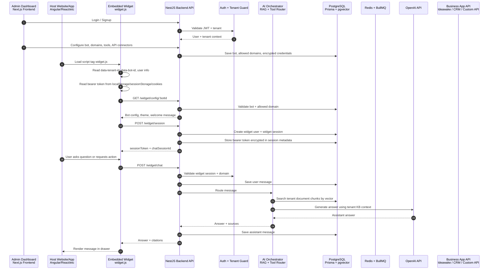
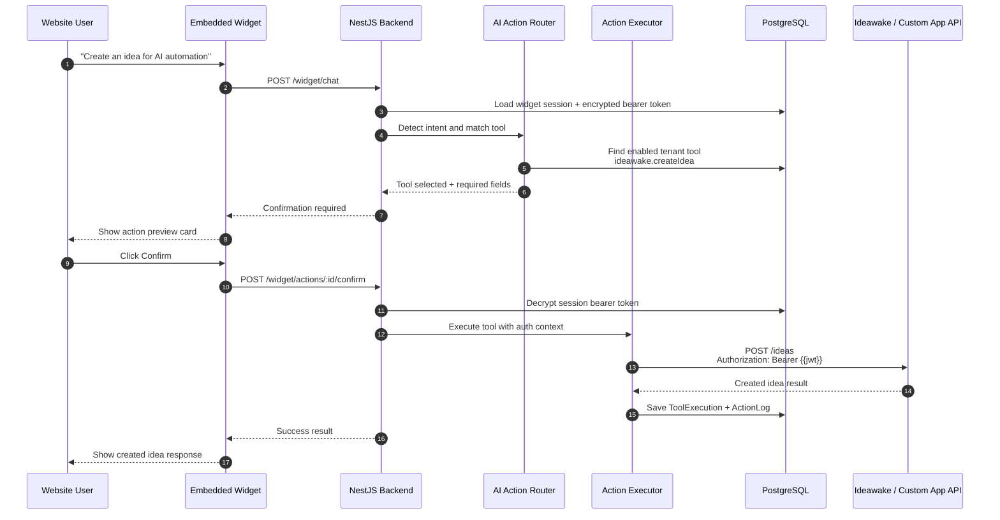
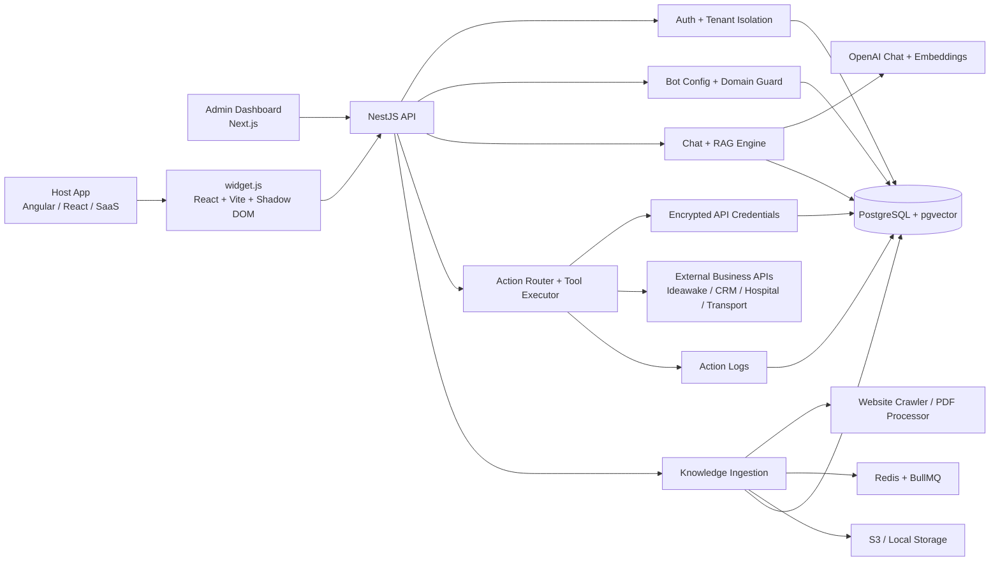
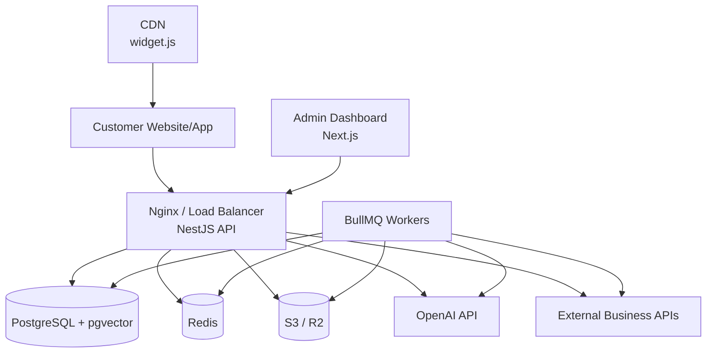

# Multi-Tenant AI Chatbot Platform Architecture

This document explains how the admin dashboard, embeddable widget, backend API, knowledge base, AI/RAG pipeline, and action-agent system work together.

## Overall Platform Flow



## Action-Agent Flow



## High-Level System View



## Main Components

### Admin Dashboard

The admin dashboard is the tenant-facing control panel. Tenant admins use it to manage:

- bot settings
- allowed widget domains
- knowledge sources
- website crawling
- PDF/document uploads
- API connectors
- action tools
- action logs
- chat history

### Embeddable Widget

The widget is loaded into any external website or SaaS app using one script tag.

Example:

```html
<script
  src="http://localhost:5173/widget.js"
  data-api-url="http://localhost:4000/api"
  data-tenant-id="TENANT_ID"
  data-bot-id="BOT_ID"
  data-user-id="CURRENT_USER_ID"
  data-user-email="CURRENT_USER_EMAIL"
  data-user-name="CURRENT_USER_NAME"
  data-token-storage-key="accessToken">
</script>
```

The widget:

- renders inside Shadow DOM to avoid CSS conflicts
- shows a floating chat launcher
- opens a right-side chat drawer
- creates a widget session with the backend
- sends chat messages to the backend
- renders knowledge answers, citations, action confirmations, and action results
- can read a host app bearer token from localStorage, sessionStorage, readable cookies, or script attributes

The widget never calls the business app API directly.

### Backend API

The NestJS backend is the trusted execution layer. It handles:

- authentication
- tenant isolation
- bot configuration
- domain allowlist checks
- widget sessions
- chat sessions and messages
- RAG retrieval
- OpenAI calls
- API connector execution
- action confirmation
- action logs
- queue dispatch

### Knowledge Base Pipeline

Knowledge ingestion supports website URLs and document uploads.

The pipeline is:

1. Tenant adds a URL or uploads a document.
2. Backend creates a knowledge source.
3. BullMQ queues background processing.
4. Crawler or document processor extracts clean text.
5. Chunking service splits content.
6. Embedding service generates vectors.
7. pgvector stores searchable tenant-specific chunks.
8. Chat retrieval uses only indexed chunks for the current tenant.

### RAG Chat Flow

For knowledge questions:

1. Widget sends the user message.
2. Backend validates widget session and tenant.
3. User message is saved.
4. Backend embeds the question.
5. Vector search retrieves top matching chunks for that tenant.
6. Backend sends context to OpenAI.
7. Assistant answer is saved with source references.
8. Widget renders the answer.

### Action-Agent Flow

For action requests:

1. User asks the widget to perform an action.
2. Backend detects the matching enabled tool.
3. Backend validates required fields.
4. For write/delete actions, backend creates an action confirmation.
5. Widget shows a confirmation card.
6. User confirms.
7. Backend decrypts the widget session token or connector credential.
8. Backend calls the external app API.
9. Backend saves execution result and action log.
10. Widget renders success or failure.

### Token Passthrough

The widget can pass the host app user's bearer token to the backend session.

Supported sources:

- `data-user-jwt`
- `data-bearer-token`
- localStorage
- sessionStorage
- readable cookies

Connector auth can reference this token using:

```json
{
  "authType": "BEARER_TOKEN",
  "authConfig": {
    "token": "{{jwt}}"
  }
}
```

Or:

```json
{
  "Authorization": "Bearer {{jwt}}"
}
```

HttpOnly cookies cannot be read by browser JavaScript. If a host app uses only HttpOnly cookies, the integration should use a signed session or server-side token exchange flow.

## Security Boundaries

The platform enforces:

- tenant isolation on every query
- bot ID and tenant ID validation
- widget allowed-domain checks
- encrypted tokens and credentials
- server-side API execution only
- action confirmation for write/delete operations
- action audit logging
- SSRF protections for custom API connectors
- JWT/session validation
- rate limiting
- CORS protection

The widget is an untrusted client. It can request actions, but only the backend validates and executes them.

## Data Stores

### PostgreSQL + pgvector

Stores:

- tenants
- users
- memberships
- bots
- bot domains
- widget users
- widget sessions
- chat sessions
- chat messages
- knowledge sources
- documents
- document chunks
- embeddings
- API connectors
- API endpoints/tools
- action confirmations
- tool executions
- action logs

### Redis + BullMQ

Runs background jobs for:

- website crawling
- document processing
- PDF extraction
- embedding generation
- source cleanup
- integration sync
- webhook processing
- action execution

### Object Storage

Stores uploaded files such as PDFs and future media assets. Local storage can be used in development, while S3 or Cloudflare R2 should be used in production.

## Production Deployment View



## Summary

The system has three major entry points:

- Admin dashboard for configuration and management.
- Embeddable widget for end users inside any website or app.
- Backend API as the secure execution layer.

The backend is the center of trust. It owns tenant isolation, knowledge retrieval, AI routing, action confirmation, external API execution, token encryption, and audit logs.
